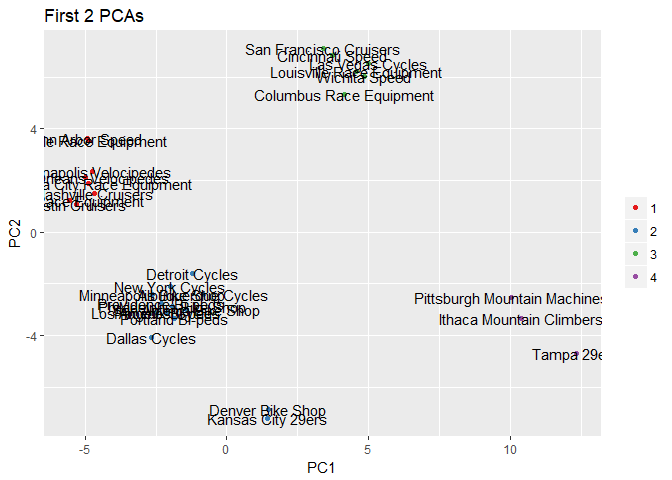
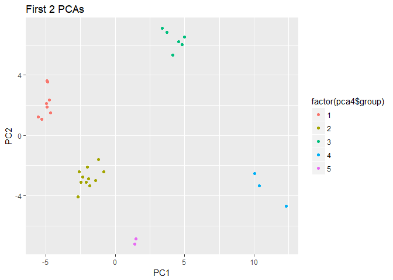

Customer Segmentation
================

The k-means clustering algorithm works by finding like groups based on Euclidean distance, a measure of distance or similarity. The practitioner selects kk groups to cluster, and the algorithm finds the best centroids for the kk groups. The practitioner can then use those groups to determine which factors group members relate. For customers, these would be their buying preferences.

To start, we’ll get need some orders to evaluate. We’ll load the data first using the xlsx package for reading Excel files.

Three Tables:

-   Products (30 Obs. 6 Variables)
-   Orders (15,644 Obs. 7 Variables)
-   Customers (97 Obs. 6 Variables)

``` r
# We'll get the data into a usable format, typical of an SQL query from an ERP database. 
# The following code merges the customers, products and orders data frames using the dplyr package.

orders_extended <- merge(orders, customers, by.x = "customer.id", by.y = "bikeshop.id")
orders_extended <- merge(orders_extended, products, by.x = "product.id", by.y = "bike.id")

orders_extended <- orders_extended %>% 
  mutate(price_extended = price * quantity) %>% 
  select(order.date, order.id, order.line, bikeshop.name, model,
         quantity, price, price_extended, category1, category2, frame) %>% 
  arrange(order.id, order.line)
```

``` r
head(orders_extended) # View of Data
```

    ##   order.date order.id order.line             bikeshop.name
    ## 1 2011-01-07        1          1  Ithaca Mountain Climbers
    ## 2 2011-01-07        1          2  Ithaca Mountain Climbers
    ## 3 2011-01-10        2          1         Kansas City 29ers
    ## 4 2011-01-10        2          2         Kansas City 29ers
    ## 5 2011-01-10        3          1 Louisville Race Equipment
    ## 6 2011-01-10        3          2 Louisville Race Equipment
    ##                      model quantity price price_extended category1
    ## 1          Jekyll Carbon 2        1  6070           6070  Mountain
    ## 2         Trigger Carbon 2        1  5970           5970  Mountain
    ## 3      Beast of the East 1        1  2770           2770  Mountain
    ## 4         Trigger Carbon 2        1  5970           5970  Mountain
    ## 5 Supersix Evo Hi-Mod Team        1 10660          10660      Road
    ## 6          Jekyll Carbon 4        1  3200           3200  Mountain
    ##       category2    frame
    ## 1 Over Mountain   Carbon
    ## 2 Over Mountain   Carbon
    ## 3         Trail Aluminum
    ## 4 Over Mountain   Carbon
    ## 5    Elite Road   Carbon
    ## 6 Over Mountain   Carbon

#### Developing a Hypothesis

Developing a hypothesis is necessary as the hypothesis will guide our decisions on how to formulate the data in such a way to cluster customers. For the Cannondale orders, our hypothesis is that bike shops purchase Cannondale bike models based on features such as Mountain or Road Bikes and price tier (high/premium or low/affordable). Although we will use bike model to cluster on, the bike model features (e.g. price, category, etc) will be used for assessing the preferences of the customer clusters (more on this later).

To start, we’ll need a unit of measure to cluster on. We can select quantity purchased or total value of purchases. We’ll select quantity purchased because total value can be skewed by the bike unit price. For example, a premium bike can be sold for 10X more than an affordable bike, which can mask the quantity buying habits.

#### Manipulating the Data Frame

Next, we need a data manipulation plan of attack to implement clustering on our data. We’ll user our hypothesis to guide us. First, we’ll need to get the data frame into a format conducive to clustering bike models to customer id’s. Second, we’ll need to manipulate price into a categorical variables representing high/premium and low/affordable. Last, we’ll need to scale the bike model quantities purchased by customer so the k-means algorithm weights the purchases of each customer evenly.

``` r
# We’ll tackle formatting the data frame for clustering first. 
# We need to spread the customers by quantity of bike models purchased.
# Group by model & model features, summarize by quantity purchased 
customer_trends <- orders_extended %>% 
  group_by(bikeshop.name, model, category1, category2, frame, price) %>% 
  summarise(total.qty = sum(quantity)) %>% 
  spread(bikeshop.name, total.qty)
customer_trends <- as.data.frame(customer_trends)
head(customer_trends[, 1:8])
```

    ##                 model category1  category2    frame price
    ## 1         Bad Habit 1  Mountain      Trail Aluminum  3200
    ## 2         Bad Habit 2  Mountain      Trail Aluminum  2660
    ## 3 Beast of the East 1  Mountain      Trail Aluminum  2770
    ## 4 Beast of the East 2  Mountain      Trail Aluminum  2130
    ## 5 Beast of the East 3  Mountain      Trail Aluminum  1620
    ## 6   CAAD Disc Ultegra      Road Elite Road Aluminum  2660
    ##   Albuquerque Cycles Ann Arbor Speed Austin Cruisers
    ## 1                  5               4               2
    ## 2                  2               6               1
    ## 3                  3               9               2
    ## 4                  3               6               2
    ## 5                  1               2              NA
    ## 6                  4              16               5

``` r
customer_trends[is.na(customer_trends)] <- 0  # Remove NA's
```

Next, we need to convert the unit price to categorical high/low variables. One way to do this is with the cut2() function from the Hmisc package. We’ll segment the price into high/low by median price. Selecting g = 2 divides the unit prices into two halves using the median as the split point.

``` r
customer_trends$price <- cut2(customer_trends$price, g=2)
levels(customer_trends$price)
```

    ## [1] "[ 415, 3500)" "[3500,12790]"

Last, we need to scale the quantity data. Unadjusted quantities presents a problem to the k-means algorithm. Some customers are larger than others meaning they purchase higher volumes. Fortunately, we can resolve this issue by converting the customer order quantities to proportion of the total bikes purchased by a customer. The prop.table() matrix function provides a convenient way to do this. An alternative is to use the scale() function, which normalizes the data. However, this is less interpretable than the proportion format.

``` r
trends_matrix <- as.matrix(customer_trends[,-(1:5)]) # Just pickup bikeshops
trends_matrix <- prop.table(trends_matrix, margin = 2) # column-wise pct
# We need to rejoin the fixed matrix back to the original table cols we dropped 
customer_trends <- cbind(as.data.frame(customer_trends[, 1:5]), as.data.frame(trends_matrix))
```

``` r
head(customer_trends[, 1:8])
```

    ##                 model category1  category2    frame        price
    ## 1         Bad Habit 1  Mountain      Trail Aluminum [ 415, 3500)
    ## 2         Bad Habit 2  Mountain      Trail Aluminum [ 415, 3500)
    ## 3 Beast of the East 1  Mountain      Trail Aluminum [ 415, 3500)
    ## 4 Beast of the East 2  Mountain      Trail Aluminum [ 415, 3500)
    ## 5 Beast of the East 3  Mountain      Trail Aluminum [ 415, 3500)
    ## 6   CAAD Disc Ultegra      Road Elite Road Aluminum [ 415, 3500)
    ##   Albuquerque Cycles Ann Arbor Speed Austin Cruisers
    ## 1        0.017482517     0.006644518     0.008130081
    ## 2        0.006993007     0.009966777     0.004065041
    ## 3        0.010489510     0.014950166     0.008130081
    ## 4        0.010489510     0.009966777     0.008130081
    ## 5        0.003496503     0.003322259     0.000000000
    ## 6        0.013986014     0.026578073     0.020325203

#### K-Means Clustering

Now we are ready to perform k-means clustering to segment our customer-base. Think of clusters as groups in the customer-base. Prior to starting we will need to choose the number of customer groups, kk, that are to be detected. The best way to do this is to think about the customer-base and our hypothesis. We believe that there are most likely to be at least four customer groups because of mountain bike vs road bike and premium vs affordable preferences. We also believe there could be more as some customers may not care about price but may still prefer a specific bike category. However, we’ll limit the clusters to eight as more is likely to overfit the segments.

#### Running the K-Means Algorithm

The code below does the following:

1.  Converts the customer\_trends data frame into kmeans\_trans. The model and features are dropped so the customer columns are all that are left. The data frame is transposed to have the customers as rows and models as columns. The kmeans() function requires this format.

2.  Performs the kmeans() function to cluster the customer segments. A loop to go from K=1:8. From our hypothesis, we expect there to be at least four and at most six groups of customers. This is because customer preference is expected to vary by price (high/low) and category1 (mountain vs bike). There may be other groupings as well. Beyond eight segments may be overfitting the segments.

3.  Using the Broom Library and glance/augment/tidy functions to obtain similarity measures. We will loop through all kk group variations and visual the results. We will also use the tot.withniss results as a technique that validates the best cluster groups.

``` r
kmeans_data <- customer_trends[, - (1:5)] # Extract only customer columns
kmeans_trans <- t(kmeans_data) # Get customers in rows and products in columns

set.seed(11531)
kclusts <- data.frame(k=1:8) %>% group_by(k) %>% do(kclusts = kmeans(kmeans_trans, .$k))

clusters <- kclusts %>% group_by(k) %>% do(tidy(.$kclusts[[1]]))
assignments <- kclusts %>% group_by(k) %>% do(augment(.$kclusts[[1]], kmeans_trans))
clusterings <- kclusts %>% group_by(k) %>% do(glance(.$kclusts[[1]]))
```

``` r
plot1 <- ggplot(assignments, aes(X1, X2)) + geom_point(aes(color=.cluster)) + facet_wrap(~ k)
plot1
```


``` r
ggplot(clusterings, aes(k, tot.withinss)) + geom_line()
```


Of particular interest is the total within sum of squares, saved in the tot.withinss column. This represents the variance within the clusters. It decreases as k increases, but one can notice a bend (or “elbow”) right at k=4. This bend indicates that additional clusters beyond the fourth have little value.

``` r
set.seed(11)
kresults <- kmeans(kmeans_trans, 4, nstart = 50) # Set KK Groups to 4

# Create list of customer names for each cluster
clusterNames <- list()
clusterList <- list()
for (clustr in 1:4) {
  clusterNames[clustr] <- paste0("X", clustr)
  clusterList[clustr] <- list(
    names(
        kresults$cluster[kresults$cluster==clustr]
        )
    )
}
names(clusterList) <- clusterNames

## Create list of customer names for each cluster -- Without Function
# 
# x1 <- rownames(kmeans_trans[kresults$cluster==1, ])
# x2 <- rownames(kmeans_trans[kresults$cluster==2, ])
# x3 <- rownames(kmeans_trans[kresults$cluster==3, ])
# x4 <- rownames(kmeans_trans[kresults$cluster==4, ])

# Combine cluster centroids with bike models for feature inspection 
customer_segmenters <- t(kresults$centers)  # Get centroids for groups
colnames(customer_segmenters) <- make.names(colnames(customer_segmenters))
customer_clusters <- cbind(customer_trends[,1:5], customer_segmenters)
```

We’ll order by cluster 1’s top ten bike models in descending order. We can quickly see that the top 10 models purchased are predominantly high-end and mountain. The all but one model has a carbon frame.

``` r
# Arrange top 10 bike models by cluster in descending order
attach(customer_clusters)  # Allows ordering by column name
head(customer_clusters[order(-X1), c(1:5, 6)], 10)
```

    ##                       model category1      category2    frame        price
    ## 83      Synapse Disc Tiagra      Road Endurance Road Aluminum [ 415, 3500)
    ## 11               CAAD12 Red      Road     Elite Road Aluminum [ 415, 3500)
    ## 88             Synapse Sora      Road Endurance Road Aluminum [ 415, 3500)
    ## 57            Slice Ultegra      Road     Triathalon   Carbon [ 415, 3500)
    ## 67   Supersix Evo Ultegra 3      Road     Elite Road   Carbon [ 415, 3500)
    ## 81         Synapse Disc 105      Road Endurance Road Aluminum [ 415, 3500)
    ## 79 Synapse Carbon Ultegra 4      Road Endurance Road   Carbon [ 415, 3500)
    ## 12           CAAD12 Ultegra      Road     Elite Road Aluminum [ 415, 3500)
    ## 58        Slice Ultegra D12      Road     Triathalon   Carbon [ 415, 3500)
    ## 68   Supersix Evo Ultegra 4      Road     Elite Road   Carbon [ 415, 3500)
    ##            X1
    ## 83 0.02460757
    ## 11 0.02288873
    ## 88 0.02230531
    ## 57 0.02207715
    ## 67 0.02185746
    ## 81 0.02112192
    ## 79 0.02037167
    ## 12 0.02007348
    ## 58 0.01953066
    ## 68 0.01943451

Next, we’ll inspect cluster 2. We can see that the top models are all low-end/affordable models. There’s a mix of road and mountain for the primariy category and a mix of frame material as well.

``` r
# Arrange top 10 bike models by cluster in descending order
attach(customer_clusters)  # Allows ordering by column name
```

    ## The following objects are masked from customer_clusters (pos = 3):
    ## 
    ##     category1, category2, frame, model, price, X1, X2, X3, X4

``` r
head(customer_clusters[order(-X2), c(1:5, 7)], 10)
```

    ##                      model category1          category2    frame
    ## 22                  F-Si 2  Mountain Cross Country Race Aluminum
    ## 57           Slice Ultegra      Road         Triathalon   Carbon
    ## 26           F-Si Carbon 4  Mountain Cross Country Race   Carbon
    ## 19              Catalyst 3  Mountain              Sport Aluminum
    ## 9          CAAD12 Disc 105      Road         Elite Road Aluminum
    ## 75 Synapse Carbon Disc 105      Road     Endurance Road   Carbon
    ## 15              CAAD8 Sora      Road         Elite Road Aluminum
    ## 93                 Trail 5  Mountain              Sport Aluminum
    ## 89                 Trail 1  Mountain              Sport Aluminum
    ## 31                 Habit 4  Mountain              Trail Aluminum
    ##           price         X2
    ## 22 [ 415, 3500) 0.02033372
    ## 57 [ 415, 3500) 0.01882103
    ## 26 [ 415, 3500) 0.01844392
    ## 19 [ 415, 3500) 0.01826012
    ## 9  [ 415, 3500) 0.01675123
    ## 75 [ 415, 3500) 0.01606174
    ## 15 [ 415, 3500) 0.01562627
    ## 93 [ 415, 3500) 0.01553162
    ## 89 [ 415, 3500) 0.01538065
    ## 31 [ 415, 3500) 0.01522496

Inspecting clusters 3 and 4 produce interesting results. For brevity, we won’t display the tables. Here’s the results:

-   Cluster 3: Tends to prefer road bikes that are low-end.
-   Cluster 4: Tends to refer road bikes that are high-end.

The customer segmentation process can be performed with various clustering algorithms. In this post, we focused on k-means clustering in R. While the algorithm is quite simple to implement, half the battle is getting the data into the correct format and interpreting the results. We went over formatting the order data, running the kmeans() function to cluster the data with several hypothetical kk clusters, using tidy(), augment(), and glance() from the broom package to determine the optimal number of kk clusters, and interpreting the results by inspection of the k-means centroids.

Additionally, we can take a quick peak of the HClustering algorithm on the same dataset. Unlike the Kmeans algorithm, the Hclustering algorithm doesn't require us to determine a "K" value beforehand.

``` r
set.seed(11)
k.hc <- eclust(kmeans_trans, "hclust") # compute hclust
```

``` r
fviz_dend(k.hc, rect = TRUE) # dendrogam
```


``` r
fviz_silhouette(k.hc) # silhouette plot
```

    ##   cluster size ave.sil.width
    ## 1       1   13          0.13
    ## 2       2    8          0.15
    ## 3       3    6          0.29
    ## 4       4    3          0.23


``` r
fviz_cluster(k.hc) # scatter plot
```


PCA is a dimensionality reduction algorithm: PCA takes your data and decomposes it using transformations into principal components (PC). Each PC is selected in the orthogonal direction that maximizes the linear variance of the data. In essence, PCA is nothing more than an algorithm that takes numeric data in x, y, z coordinates and changes the coordinates to x’, y’, and z’ that maximize the linear variance.

How does this help in customer segmentation / community detection? Unlike k-means, PCA is not a direct solution. What PCA helps with is visualizing the essence of a data set. Because PCA selects PC’s based on the maximum linear variance, we can use the first few PC’s to describe a vast majority of the data set without needing to compare and contrast every single feature. By using PC1 and PC2, we can then visualize in 2D and inspect for clusters. We can also combine the results with the k-means groups to see what k-means detected as compared to the clusters in the PCA visualization.

``` r
# Manipulate data for PCA Analyis
pca <- prcomp(t(customer_trends[, -(1:5)]), scale = T, center = T) 
summary(pca)
```

    ## Importance of components:
    ##                           PC1    PC2    PC3     PC4    PC5     PC6     PC7
    ## Standard deviation     4.9852 4.2206 2.2308 2.18304 2.1169 2.03586 1.86265
    ## Proportion of Variance 0.2562 0.1836 0.0513 0.04913 0.0462 0.04273 0.03577
    ## Cumulative Proportion  0.2562 0.4399 0.4911 0.54028 0.5865 0.62921 0.66498
    ##                            PC8     PC9    PC10    PC11    PC12    PC13
    ## Standard deviation     1.80739 1.76329 1.70165 1.61928 1.55759 1.50889
    ## Proportion of Variance 0.03368 0.03205 0.02985 0.02703 0.02501 0.02347
    ## Cumulative Proportion  0.69865 0.73071 0.76056 0.78759 0.81260 0.83607
    ##                           PC14    PC15    PC16    PC17    PC18    PC19
    ## Standard deviation     1.46505 1.30348 1.26612 1.22705 1.18511 1.13653
    ## Proportion of Variance 0.02213 0.01752 0.01653 0.01552 0.01448 0.01332
    ## Cumulative Proportion  0.85820 0.87572 0.89224 0.90776 0.92224 0.93556
    ##                           PC20    PC21    PC22    PC23    PC24    PC25
    ## Standard deviation     1.04480 0.98599 0.87912 0.84801 0.80364 0.74209
    ## Proportion of Variance 0.01125 0.01002 0.00797 0.00741 0.00666 0.00568
    ## Cumulative Proportion  0.94681 0.95684 0.96480 0.97222 0.97888 0.98455
    ##                           PC26   PC27   PC28    PC29      PC30
    ## Standard deviation     0.69318 0.6607 0.5990 0.47169 2.214e-15
    ## Proportion of Variance 0.00495 0.0045 0.0037 0.00229 0.000e+00
    ## Cumulative Proportion  0.98951 0.9940 0.9977 1.00000 1.000e+00

``` r
pca_fort <- fortify(pca) # fortify() gets pca into usable format

# Add group (short for color) column using k=4
pca4 <- cbind(pca_fort, group=kresults$cluster)

ggplot(pca4) +
  geom_point(aes(x = PC1, y = PC2, color = factor(pca4$group)))+
  labs(title = "First 2 PCAs") +
  scale_color_brewer(name = "", palette = "Set1") +
  geom_text(aes(label = rownames(pca4), x = PC1, y = PC2))
```



``` r
pca4[rownames(pca4) %in% c("Denver Bike Shop", "Kansas City 29ers"), 128] <- 5

# Visualize Results to see new grouping
ggplot(pca4) +
  geom_point(aes(x = PC1, y = PC2, color = factor(pca4$group)))+
  labs(title = "First 2 PCAs")
```



The script below modifies the customer\_trends data frame to select only customer columns that are in the group we want to inspect. The script then takes the average of the customer’s percent of quantity purchased vs total quantity purchased (the values in the customer columns). The data frame is sorted by most frequently purchased so we can see the group’s central tendency. For Group 5, the central tendency is a preference for low-end mountain bikes.

``` r
group_num <- 5
group_names <- rownames(pca4[pca4$group == group_num, ])
group_trends <- customer_trends %>% 
  select(model:price, match(group_names, names(.))) # use match() to select column names
group_avg <- apply(group_trends[6:ncol(group_trends)], 1, mean) # take average values
group_trends <- bind_cols(group_trends, as_data_frame(group_avg)) %>% 
  arrange(-group_avg)

head(group_trends, 10) #Top ten products by group avg. pct. purchased
```

    ##                  model category1          category2    frame        price
    ## 1           Catalyst 2  Mountain              Sport Aluminum [ 415, 3500)
    ## 2              Trail 5  Mountain              Sport Aluminum [ 415, 3500)
    ## 3        F-Si Carbon 4  Mountain Cross Country Race   Carbon [ 415, 3500)
    ## 4         Scalpel 29 4  Mountain Cross Country Race Aluminum [ 415, 3500)
    ## 5           Catalyst 4  Mountain              Sport Aluminum [ 415, 3500)
    ## 6               F-Si 1  Mountain Cross Country Race Aluminum [ 415, 3500)
    ## 7              Trail 4  Mountain              Sport Aluminum [ 415, 3500)
    ## 8              Trail 1  Mountain              Sport Aluminum [ 415, 3500)
    ## 9              Trail 2  Mountain              Sport Aluminum [ 415, 3500)
    ## 10 Beast of the East 1  Mountain              Trail Aluminum [ 415, 3500)
    ##    Denver Bike Shop Kansas City 29ers      value
    ## 1        0.02564103        0.01872659 0.02218381
    ## 2        0.02042590        0.02160761 0.02101675
    ## 3        0.01651456        0.02477672 0.02064564
    ## 4        0.01868753        0.02103140 0.01985947
    ## 5        0.01999131        0.01843849 0.01921490
    ## 6        0.02042590        0.01757419 0.01900004
    ## 7        0.01521078        0.02189571 0.01855324
    ## 8        0.02042590        0.01642178 0.01842384
    ## 9        0.02086050        0.01584558 0.01835304
    ## 10       0.01825293        0.01815039 0.01820166

Let’s compare to Group 5. Rerun the previous script changing group.num from 5 to 2. We can see that Group 2’s preference is similar to Group 5 in that both groups prefer low-end/affordable bikes. However, Group 2’s top purchases contain a mixture of Mountain and Road, while Group 5’s top purchases are exclusively Mountain. It appears there is a difference!

``` r
group_num <- 2
group_names <- rownames(pca4[pca4$group == group_num, ])
group_trends <- customer_trends %>% 
  select(model:price, match(group_names, names(.))) # use match() to select column names
group_avg <- apply(group_trends[6:ncol(group_trends)], 1, mean) # take average values
group_trends <- bind_cols(group_trends, as_data_frame(group_avg)) %>% 
  arrange(-group_avg)

head(group_trends[,1:8], 10) #Top ten products by group avg. pct. purchased
```

    ##                      model category1          category2    frame
    ## 1                   F-Si 2  Mountain Cross Country Race Aluminum
    ## 2            Slice Ultegra      Road         Triathalon   Carbon
    ## 3          CAAD12 Disc 105      Road         Elite Road Aluminum
    ## 4               Catalyst 3  Mountain              Sport Aluminum
    ## 5            F-Si Carbon 4  Mountain Cross Country Race   Carbon
    ## 6  Synapse Carbon Disc 105      Road     Endurance Road   Carbon
    ## 7               CAAD8 Sora      Road         Elite Road Aluminum
    ## 8         Synapse Disc 105      Road     Endurance Road Aluminum
    ## 9               CAAD12 105      Road         Elite Road Aluminum
    ## 10        Trigger Carbon 4  Mountain      Over Mountain   Carbon
    ##           price Albuquerque Cycles Dallas Cycles Detroit Cycles
    ## 1  [ 415, 3500)        0.017482517   0.025641026    0.011904762
    ## 2  [ 415, 3500)        0.010489510   0.008547009    0.009920635
    ## 3  [ 415, 3500)        0.013986014   0.008547009    0.029761905
    ## 4  [ 415, 3500)        0.031468531   0.042735043    0.017857143
    ## 5  [ 415, 3500)        0.010489510   0.012820513    0.023809524
    ## 6  [ 415, 3500)        0.013986014   0.017094017    0.009920635
    ## 7  [ 415, 3500)        0.006993007   0.021367521    0.009920635
    ## 8  [ 415, 3500)        0.027972028   0.021367521    0.001984127
    ## 9  [ 415, 3500)        0.006993007   0.029914530    0.027777778
    ## 10 [ 415, 3500)        0.006993007   0.008547009    0.009920635

#### Conclusion

PCA can be a valuable cross-check to k-means for customer segmentation. While k-means got us close to the true customer segments, visually evaluating the groups using PCA helped identify a different customer segment, one that the k=4 k-means solution did not pick up.
